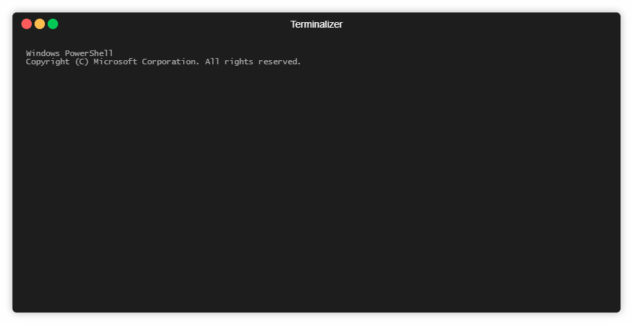

# Word Guess CLI
A "Hangman" type game you can play in your terminal.

# Getting Started
This application is designed to run in a CLI using Node.

## Prerequisites
Beyond a terminal and Node, you will need to install these NPMs;
* Colors.js
* Inquirer.js

## Optional, but fun;
* Terminalizer.js (to record yourself playing the game)

# How To Play
1. After launching the game, you will see some blanks. Each represents a letter from the name of a GWAR character.
2. Type a letter to guess if it is in the random word.
3. Each time you guess an incorrect letter, your "Guesses Remaining" will reduce by 1. Once this reaches zero, you lose!
4. If you guess the random word before exhausting your guesses remaining, you win!
5. The game will display a new word to guess.

# Example (using Terminalizer)

